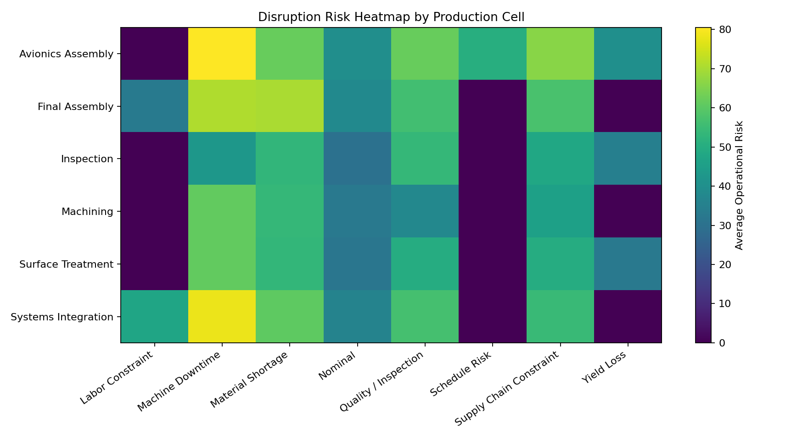
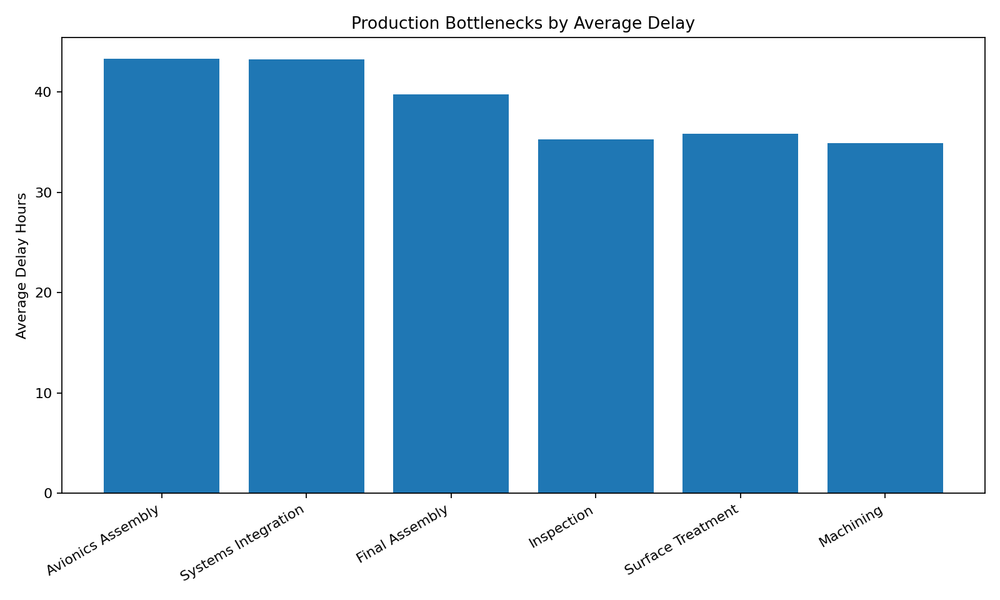
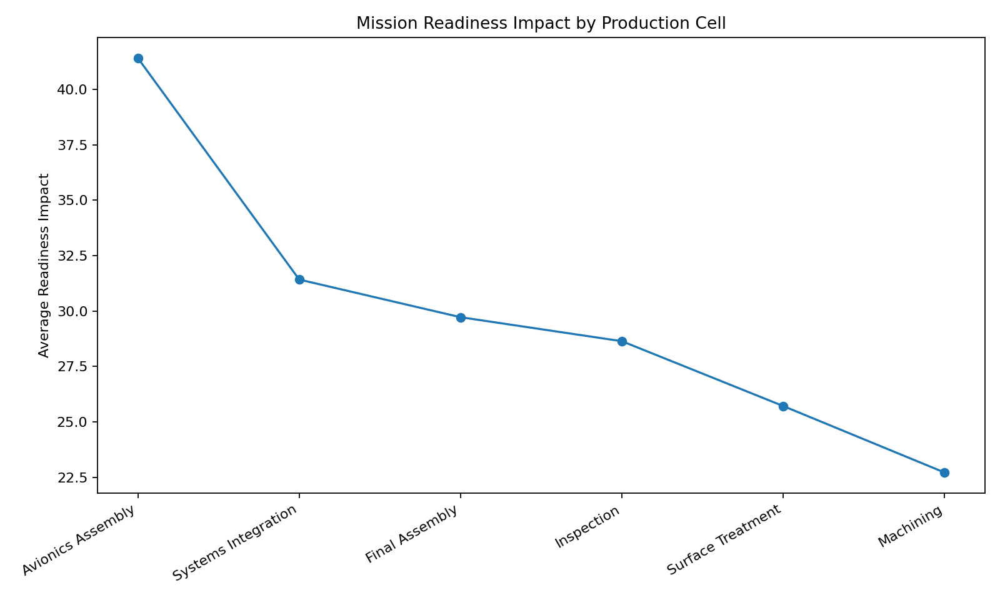
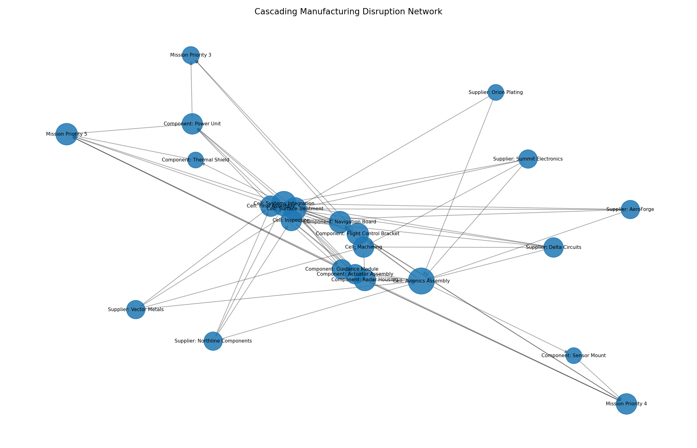

# Autonomous Manufacturing Recovery System

This project is a Python and Streamlit-based manufacturing operations analytics platform that simulates disruption recovery workflows, operational bottleneck analysis, and AI-assisted manufacturing decision support using synthetic defense-oriented manufacturing data.

The dashboard uses simulated production operations data to model supply chain disruptions, machine downtime, workforce shortages, quality holds, inspection backlog, and operational readiness impacts across multiple manufacturing cells.

The system evaluates operational risk, prioritizes recovery actions, generates AI-assisted recovery recommendations, and visualizes how manufacturing disruptions affect production readiness and delivery timelines.

---

## Project Disclaimer

This project uses fully synthetic manufacturing operations data only. It does not contain real defense, aerospace, supplier, production, logistics, contract, manufacturing, export-controlled, classified, proprietary, or operational information.

The recovery logic and operational analytics are rule-based and intended strictly for demonstration purposes. This project is designed to simulate manufacturing analytics and operational decision-support workflows, not replace real production planning, ERP systems, MES platforms, or manufacturing execution processes.

---

## Project Overview

This project demonstrates how operational analytics, disruption simulation, and AI-assisted recovery workflows can support manufacturing readiness and production recovery decision-making.

The platform simulates a manufacturing environment with:

- Production cells
- Supplier dependencies
- Machine status conditions
- Inventory shortages
- Quality failures
- Labor constraints
- Inspection backlog
- Operational recovery planning

The goal is to show how manufacturing operations data can be transformed into actionable operational insights through:

- Disruption scoring
- Bottleneck identification
- Recovery prioritization
- Operational risk analysis
- Readiness impact modeling
- AI-assisted recovery recommendations
- Interactive manufacturing analytics dashboards

---

## Why This Project Matters

Manufacturing environments, especially defense and aerospace manufacturing environments, operate under tight delivery timelines, supplier constraints, workforce limitations, and quality requirements.

A disruption in one production area can cascade through downstream operations and affect:

- Production readiness
- Delivery schedules
- Mission-critical programs
- Inspection backlog
- Operational throughput

For example:

- A supplier shortage may delay avionics assembly
- A machine outage may create machining bottlenecks
- Inspection backlog may slow release approvals
- Workforce shortages may impact final assembly throughput
- Quality failures may trigger rework or scrap conditions

This project demonstrates how operational analytics and AI-assisted recovery logic can help manufacturing teams identify bottlenecks, prioritize disruptions, estimate operational impact, evaluate recovery confidence, support manufacturing replanning workflows, and improve operational visibility.

---

## Dataset

This project uses a fully synthetic manufacturing operations dataset generated by the project itself.

The generated dataset includes fields such as:

- Work Order ID
- Program Name
- Platform
- Production Cell
- Operation Step
- Component Type
- Supplier
- Machine ID
- Machine Status
- Quality Flag
- Defect Type
- Inventory Level
- Reorder Point
- Supplier Risk
- Supplier Lead Time
- Workforce Availability
- Inspection Backlog Hours
- First Pass Yield
- Mission Priority
- Delivery Deadline
- Recovery Confidence
- Estimated Delay Hours
- Estimated Recovery Hours
- Operational Risk
- Readiness Impact

The dataset simulates manufacturing conditions across production areas such as:

- Machining
- Avionics Assembly
- Systems Integration
- Inspection
- Surface Treatment
- Final Assembly

---

## Why Synthetic Data?

Real manufacturing operations data is often proprietary, export-controlled, operationally sensitive, contract-restricted, defense-related, and supplier-sensitive.

Even anonymized manufacturing data can reveal production bottlenecks, supplier dependencies, operational throughput, manufacturing capacity, quality performance, and delivery constraints.

Synthetic data allows this project to safely demonstrate:

- Manufacturing analytics
- Operational disruption modeling
- Recovery planning workflows
- Bottleneck analysis
- Readiness impact simulation
- AI-assisted operational decision support
- Dashboard development
- Defense-oriented manufacturing analytics concepts

---

## Key Features

- Generates synthetic manufacturing operations data
- Simulates manufacturing disruptions and operational bottlenecks
- Models supplier constraints and inventory shortages
- Simulates machine downtime and degraded equipment conditions
- Simulates workforce shortages and labor constraints
- Simulates quality holds, rework conditions, and scrap risk
- Calculates operational risk scores
- Calculates readiness impact scores
- Assigns disruption categories
- Assigns recovery priorities
- Generates AI-assisted recovery recommendations
- Estimates recovery confidence and recovery timelines
- Produces operational recovery reports
- Creates static PNG visualizations
- Provides an interactive Streamlit dashboard
- Includes scenario simulation sliders
- Includes disruption heatmaps and operational risk analysis
- Includes cascading disruption network analysis
- Uses simulated data only

---

## Visualizations

The project generates static PNG visualizations that summarize operational disruptions, manufacturing bottlenecks, readiness impact, and AI-assisted recovery conditions across the simulated production environment.

These visualizations are designed to support operational decision-making by helping identify high-risk production areas, disruption concentration, recovery priorities, and manufacturing constraints.

---

### Disruption Risk Heatmap

This heatmap visualizes operational risk concentration across production cells and disruption categories. This type of visualization helps operational teams quickly identify where disruption pressure is accumulating within the manufacturing environment.

The chart helps identify which production areas are most affected by specific operational disruptions such as:

- machine downtime
- supply chain constraints
- labor shortages
- quality holds
- material shortages
- schedule risk

For example:

- Avionics Assembly may experience elevated supplier-related disruption risk
- Surface Treatment may show higher quality-related disruption concentration
- Final Assembly may show elevated workforce or coordination bottlenecks



---

### Production Bottlenecks

This chart shows average estimated operational delay by production cell.

The visualization highlights which manufacturing areas are experiencing the greatest operational slowdown based on:

- supplier constraints
- equipment degradation
- inspection backlog
- workforce shortages
- quality disruptions

Higher-delay production cells may indicate:

- operational bottlenecks
- constrained throughput
- downstream production risk
- elevated recovery requirements

This chart helps simulate how disruptions propagate across manufacturing operations and affect production flow.



---

### Readiness Impact

This chart visualizes how operational disruptions affect manufacturing readiness across production cells.

The readiness impact score combines:

- operational risk
- mission priority
- estimated delay
- delivery pressure
- recovery complexity

Higher readiness impact values indicate disruptions that may significantly affect:

- production schedules
- operational delivery timelines
- mission-critical manufacturing priorities
- downstream assembly operations

This visualization helps prioritize operational recovery efforts toward the most operationally significant disruptions.



---

### Cascading Disruption Network

This network visualization models how operational disruptions can cascade through a manufacturing environment.

The network links:

- suppliers
- production cells
- component types
- mission priority levels

for high-impact simulated work orders.

The visualization demonstrates how upstream disruptions such as supplier instability or machine downtime can propagate into downstream production areas and affect manufacturing readiness.

This type of operational dependency visualization is useful for:

- disruption analysis
- bottleneck tracing
- recovery prioritization
- operational risk review
- manufacturing resilience planning



---

## How to Run the Project

### 1. Install dependencies

```powershell
pip install -r requirements.txt
```

If needed, use:

```powershell
python -m pip install -r requirements.txt
```

### 2. Generate the synthetic manufacturing dataset

```powershell
python src/data_generator.py
```

This creates:

```text
data/manufacturing_operations.csv
```

### 3. Run the full project pipeline

```powershell
python src/main.py
```

This generates the scored manufacturing operations dataset, recovery planning outputs, operational recovery report, and PNG visualizations.

### 4. Launch the Streamlit dashboard

```powershell
streamlit run app/streamlit_app.py
```

---

## Generated CSV Outputs

Running the project creates several CSV outputs that support the manufacturing recovery workflow.

### `data/manufacturing_operations.csv`

This is the base synthetic manufacturing operations dataset generated by `src/data_generator.py` or `src/main.py`.

It contains simulated work orders, production cells, suppliers, machine status, quality flags, inventory levels, workforce availability, inspection backlog, mission priority, operational risk, readiness impact, and recovery confidence values.

### `outputs/reports/scored_manufacturing_operations.csv`

This file contains the full scored manufacturing operations dataset.

It includes the original synthetic work order data plus disruption classifications, recovery priority labels, escalation indicators, bottleneck severity scores, operational risk scores, readiness impact scores, and recovery planning fields.

### `outputs/reports/production_cell_summary.csv`

This file summarizes manufacturing conditions by production cell.

It includes production-cell-level metrics such as work order count, average operational risk, average estimated delay, average readiness impact, average recovery hours, average recovery confidence, high-risk work order count, critical work order count, and escalation totals.

### `outputs/reports/recovery_recommendations.csv`

This file contains the ranked recovery recommendation output.

It includes AI-assisted recommended actions, mitigation effectiveness, avoided delay hours, recovery value scores, recovery priorities, disruption categories, and work-order-level recovery details.

---

## Tech Stack

- Python
- Pandas
- NumPy
- Plotly
- Matplotlib
- Streamlit
- NetworkX
- CSV
- Markdown

---

## File Breakdown

### `app/streamlit_app.py`

This file runs the interactive Streamlit dashboard. It loads the manufacturing operations dataset, applies disruption simulation logic, recalculates operational risk metrics, visualizes production bottlenecks, displays recovery recommendations, generates operational heatmaps, and supports scenario-based operational analysis.

### `src/data_generator.py`

This file generates the synthetic manufacturing operations dataset. It creates simulated work orders, production cell conditions, supplier constraints, machine states, workforce availability, inspection backlog, quality conditions, recovery confidence values, and operational readiness metrics.

### `src/disruption_engine.py`

This file classifies operational disruptions and bottlenecks. It identifies disruption categories such as machine downtime, labor constraints, quality holds, material shortages, supply chain constraints, yield loss, and schedule risk conditions.

### `src/recovery_engine.py`

This file generates AI-assisted operational recovery recommendations. It prioritizes recovery actions, estimates mitigation effectiveness, calculates recovery value scores, and produces operational recovery guidance based on manufacturing conditions.

### `src/simulation_engine.py`

This file applies manufacturing disruption simulation logic. It models supplier disruptions, machine downtime, workforce reduction, and quality degradation across different production cells.

### `src/reporting.py`

This file creates the executive-style operational recovery report. The report summarizes manufacturing conditions, operational risk metrics, disruption drivers, recovery priorities, and AI-assisted operational recommendations.

### `src/visualization.py`

This file creates static PNG visualizations from the manufacturing operations dataset. It generates disruption heatmaps, production bottleneck charts, readiness impact visualizations, and cascading disruption network visuals.

### `src/main.py`

This file runs the full manufacturing analytics pipeline. It generates or loads the dataset, applies disruption scoring, generates recovery recommendations, creates visualizations, and builds the operational recovery report.

### `outputs/reports/recovery_action_report.txt`

This file contains the generated executive-style operational recovery report.

---

## Project Structure

```text
autonomous-manufacturing-recovery-system/
│
├── README.md
├── requirements.txt
│
├── app/
│   └── streamlit_app.py
│
├── data/
│   └── manufacturing_operations.csv              # Generated by src/data_generator.py or src/main.py
│
├── outputs/
│   ├── figures/                                  # Generated by src/visualization.py or src/main.py
│   │   ├── cascading_disruption_network.png      # Generated output
│   │   ├── disruption_heatmap.png                # Generated output
│   │   ├── production_bottlenecks.png            # Generated output
│   │   └── readiness_impact.png                  # Generated output
│   │
│   └── reports/                                  # Generated by src/reporting.py or src/main.py
│       ├── production_cell_summary.csv           # Generated output
│       ├── recovery_action_report.txt            # Generated output
│       ├── recovery_recommendations.csv          # Generated output
│       └── scored_manufacturing_operations.csv   # Generated output
│
├── src/
│   ├── data_generator.py                         # Generates synthetic manufacturing data
│   ├── disruption_engine.py                      # Classifies disruptions and bottlenecks
│   ├── main.py                                   # Runs the full project pipeline
│   ├── recovery_engine.py                        # Generates recovery recommendations
│   ├── reporting.py                              # Creates the recovery action report
│   ├── simulation_engine.py                      # Applies scenario simulation logic
│   └── visualization.py                          # Creates static PNG visualizations
```